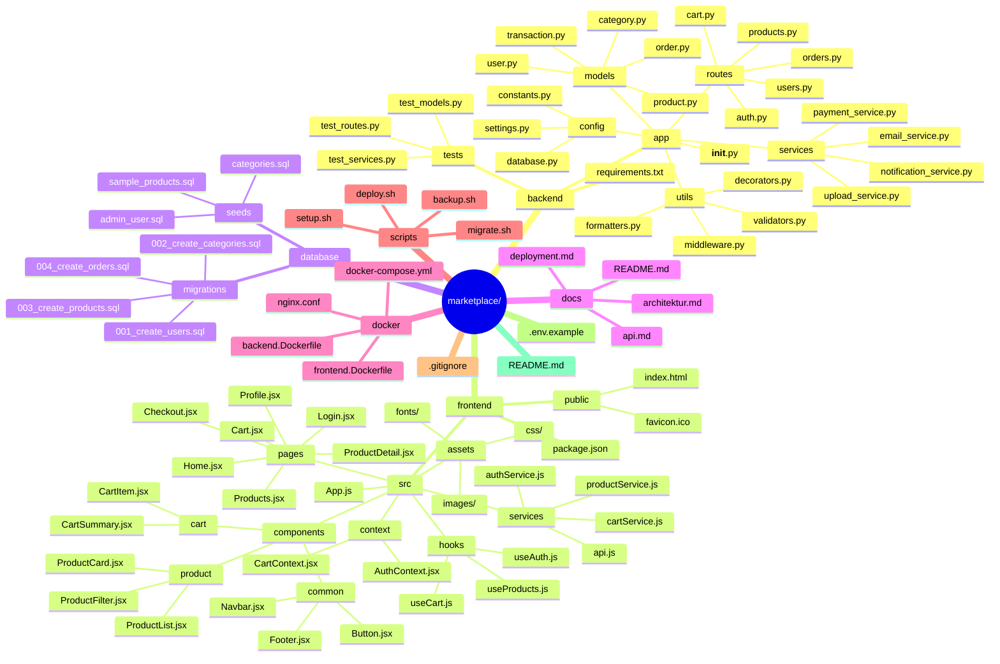

  <h1>🛒 ZL Market Place</h1>

  

  
  
  
  
  

---

  

## 📖 Gambaran Umum  

**ZL Market Place** adalah platform **e-commerce** dengan arsitektur **full-stack** yang memisahkan **backend API** dan **frontend client**.  
Proyek ini dirancang agar scalable, modular, dan mudah untuk di-deploy.  

---

## 📂 Struktur Folder 

---

# 📂 Struktur Folder Marketplace

| Folder / File                  | Keterangan                                                                 |
|--------------------------------|----------------------------------------------------------------------------|
| `marketplace/`                 | Root folder utama proyek                                                   |
| `marketplace/backend/`         | Folder backend (API, logika server, model database)                        |
| `marketplace/backend/app/`     | Entry point aplikasi backend                                               |
| `marketplace/backend/app/models/` | Database models (user, product, order, transaction)                      |
| `marketplace/backend/app/routes/` | API endpoints (auth, products, cart, orders, users)                      |
| `marketplace/backend/app/services/` | Business logic (payment, email, notification, upload)                   |
| `marketplace/backend/app/utils/` | Helper functions (validators, formatters, middleware, decorators)         |
| `marketplace/backend/config/`  | Configurations (database, API keys, constants)                             |
| `marketplace/backend/tests/`   | Unit & integration tests                                                   |
| `marketplace/backend/requirements.txt` | Dependencies backend (Python/Node.js)                                |
| `marketplace/frontend/`        | Folder frontend (UI untuk user)                                           |
| `marketplace/frontend/public/` | File statis (favicon, logo, gambar)                                        |
| `marketplace/frontend/src/`    | Source frontend (components, pages, services, context, hooks, assets)      |
| `marketplace/frontend/src/components/` | Komponen reusable (navbar, footer, product card, cart)                 |
| `marketplace/frontend/src/pages/` | Halaman (home, products, product detail, cart, checkout, profile, login) |
| `marketplace/frontend/src/services/` | Komunikasi ke API backend                                             |
| `marketplace/frontend/src/context/` | React Context untuk state management                                     |
| `marketplace/frontend/src/hooks/` | Custom hooks (useAuth, useCart, useProducts)                             |
| `marketplace/frontend/package.json` | Dependency frontend (React/Vue/Next.js)                                 |
| `marketplace/database/`        | Database migrations & seeds                                                |
| `marketplace/database/migrations/` | Skema perubahan database                                               |
| `marketplace/database/seeds/`  | Data awal (kategori, admin, sample products)                               |
| `marketplace/docs/`            | Dokumentasi proyek (API, arsitektur, deployment, README tambahan)          |
| `marketplace/docker/`          | Docker compose / deployment configs                                        |
| `marketplace/scripts/`         | Script otomatisasi (deploy, backup, setup, migrate)                        |
| `.gitignore`                   | File yang diabaikan git                                                   |
| `.env.example`                 | Template environment variables                                            |
| `README.md`                    | Dokumentasi utama proyek                                                 |
| `LICENSE`                      | Lisensi proyek (MIT)                                                      |

---

## 🛠️ Teknologi yang Disarankan  

### 🔹 Backend  
- **Python**: Flask / FastAPI + SQLAlchemy  
- **Node.js**: Express.js + Sequelize/Prisma  
- **Database**: PostgreSQL / MySQL  
- **Cache**: Redis  
- **Storage**: AWS S3 / Local Storage  

### 🔹 Frontend  
- **React.js** (Vite / CRA)  
- **Vue.js** (Nuxt.js)  
- **Next.js** untuk SSR  
- Styling: **Tailwind CSS** / Material-UI  

### 🔹 Deployment  
- Containerization: **Docker**  
- Orchestration: **Docker Compose**  
- Web Server: **Nginx**  
- Hosting: VPS, AWS, Vercel, atau Netlify  

---

## 🚀 Fitur Utama  

- 🔐 Autentikasi & Otorisasi  
- 🛍️ Manajemen Produk  
- 🛒 Keranjang Belanja  
- 💳 Sistem Pembayaran  
- 📦 Order Management  
- 🔔 Notifikasi  
- 📊 Admin Dashboard  

---

## 🏗️ Langkah Pengembangan  

1. Setup database & models  
2. Implementasi API backend  
3. Pengembangan UI frontend  
4. Integrasi frontend–backend  
5. Testing & deployment  

---

## 📜 Lisensi  
Proyek ini dilisensikan di bawah [MIT License](./LICENSE).  

---
✨ Dibangun dengan semangat oleh **Kong Ali & Tim**

---

<h3 align="center">💡 ☕ Traktir Kopi & Nasi Padang ama nasi Gorengnya ya cuy! 😄</h3>

## Dukung terus biar semangat bikin karya edukatif lainnya...  
## Keep supporting so I stay motivated to create more educational works...

# 💡 ☕  [Buy Me a Coffee via PayPal](https://www.paypal.com/paypalme/bungtempong99)  

Support with ☕ so I can buy 🍜 and keep being 🧠!

---

<h2>📫 Let’s Connect Like Hackers</h2>

| Platform | Detail |
|:--------|:-------|
| GitHub  | [kongali1720](https://github.com/kongali1720) |
| Email   | [kongali1720@gmail.com](mailto:kongali1720@gmail.com) |
| Site    | [younext&Deutsche-bank](https://younext.cloud) |
| Site    | [Portfolio](https://kongali1720.com) |

---

## ❤️  💻 INITIATING HUMANITY MODE... for Down Syndrome ❤️

| Item        | Keterangan / Description |
|:------------|:-------------------------|
| 🎯 Target   | Anak-anak Pejuang Down Syndrome / Kids with Down Syndrome |
| 📡 Status   | Butuh Dukungan / Needs Support |
| 🧠 Response | Buka Hati + Klik Link = Satu Senyum Baru / Open Heart + Click Link = One New Smile |

Mereka bukan berbeda — mereka dilahirkan untuk mengajarkan dunia tentang cinta yang murni dan kesabaran yang luar biasa.  
They are not different — they were born to teach the world pure love and extraordinary patience.

  

---

<section align="center" style="font-family: Arial, sans-serif;">

<h2 style="margin-bottom: 20px; color: #0070f3;">💳 Dukungan Pembayaran DONASINYA</h2>

<table align="center" aria-label="Metode Pembayaran" style="margin: 0 auto; border-collapse: collapse; box-shadow: 0 4px 10px rgba(0,0,0,0.1); border-radius: 8px; overflow: hidden;">
  <thead style="background-color: #0070f3; color: white;">
    <tr>
      <th style="padding: 12px 25px; font-size: 18px;">Visa</th>
      <th style="padding: 12px 25px; font-size: 18px;">Mastercard</th>
      <th style="padding: 12px 25px; font-size: 18px;">PayPal</th>
    </tr>
  </thead>
  <tbody style="background-color: #f9f9f9;">
    <tr>
      <td style="padding: 15px;">
        
      </td>
      <td style="padding: 15px;">
        
      </td>
      <td style="padding: 15px;">
        
      </td>
    </tr>
  </tbody>
</table>

</section>

---

  Kalau project ini bantu kamu, jangan lupa kasih bintang ⭐ dan share ke temen-temen ya! 
  Follow <a href="https://twitter.com/kongali1720" target="_blank" rel="noopener noreferrer">@kongali1720</a> buat diskusi dan update seru lainnya 🔥

  

---

Built with ❤️ for the Ethereum community

