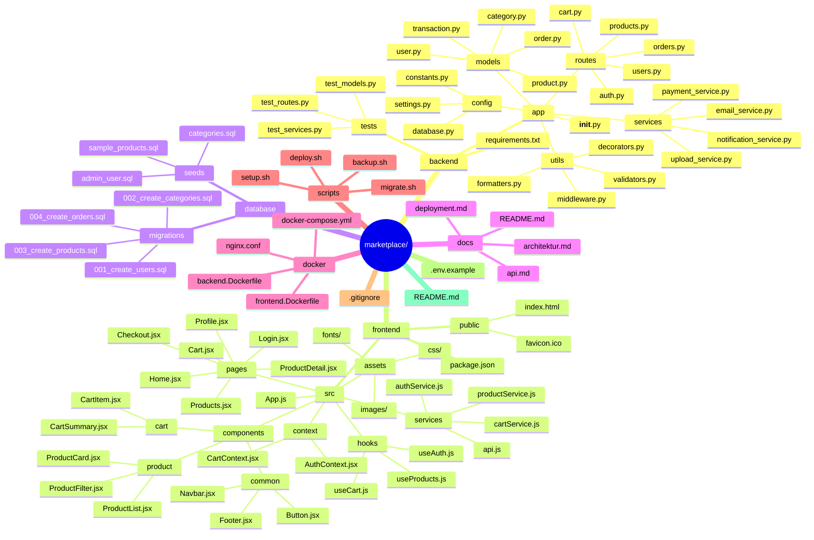

# 🛒 ZL Market Place  

---

  

## 📖 Gambaran Umum  

**ZL Market Place** adalah platform **e-commerce** dengan arsitektur **full-stack** yang memisahkan **backend API** dan **frontend client**.  
Proyek ini dirancang agar scalable, modular, dan mudah untuk di-deploy.  

---

## 📂 Struktur Folder 

---

## 🛠️ Teknologi yang Disarankan  

### 🔹 Backend  
- **Python**: Flask / FastAPI + SQLAlchemy  
- **Node.js**: Express.js + Sequelize/Prisma  
- **Database**: PostgreSQL / MySQL  
- **Cache**: Redis  
- **Storage**: AWS S3 / Local Storage  

### 🔹 Frontend  
- **React.js** (Vite / CRA)  
- **Vue.js** (Nuxt.js)  
- **Next.js** untuk SSR  
- Styling: **Tailwind CSS** / Material-UI  

### 🔹 Deployment  
- Containerization: **Docker**  
- Orchestration: **Docker Compose**  
- Web Server: **Nginx**  
- Hosting: VPS, AWS, Vercel, atau Netlify  

---

## 🚀 Fitur Utama  

- 🔐 Autentikasi & Otorisasi  
- 🛍️ Manajemen Produk  
- 🛒 Keranjang Belanja  
- 💳 Sistem Pembayaran  
- 📦 Order Management  
- 🔔 Notifikasi  
- 📊 Admin Dashboard  

---

## 🏗️ Langkah Pengembangan  

1. Setup database & models  
2. Implementasi API backend  
3. Pengembangan UI frontend  
4. Integrasi frontend–backend  
5. Testing & deployment  

---

## 📜 Lisensi  
Proyek ini dilisensikan di bawah [MIT License](./LICENSE).  

---
✨ Dibangun dengan semangat oleh **Kong Ali & Tim**
